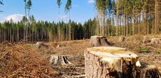
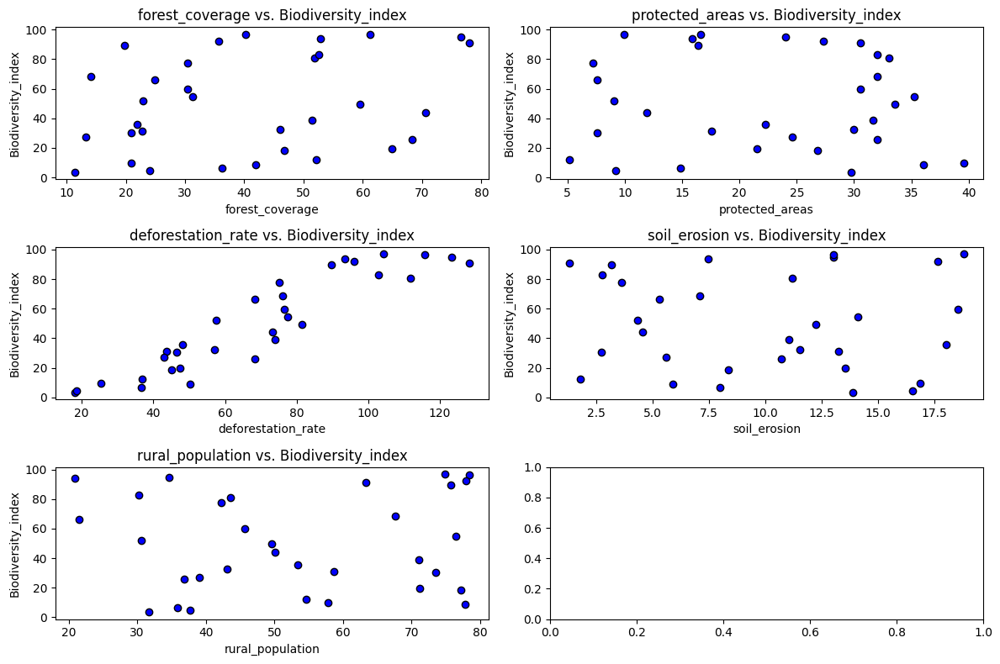
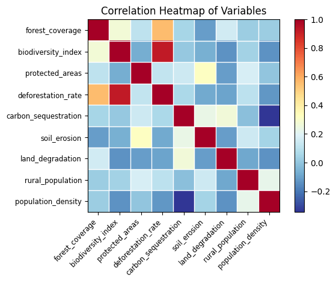
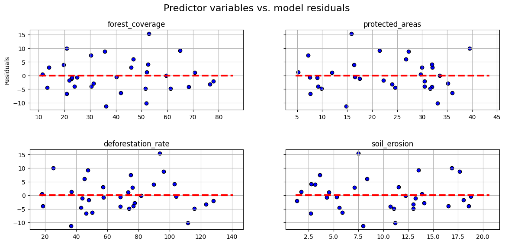
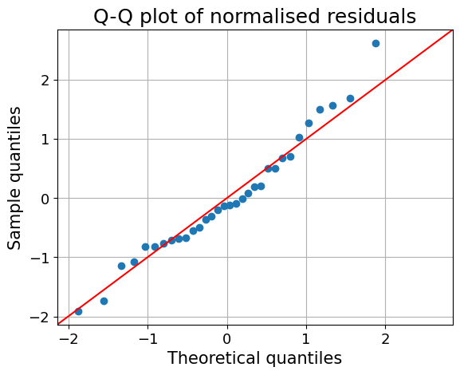
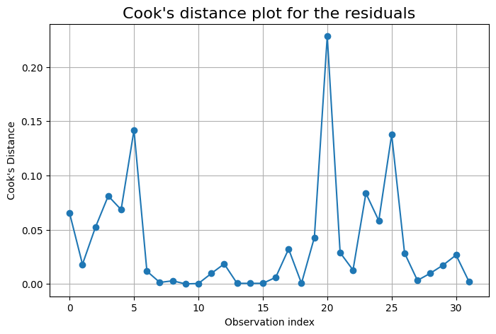

# **PREDICTION OF BIODIVERSITY INDEX BASED ON HUMAN ACTIVITIES**  
*Multiple Linear Regression | Environmental Data Analysis*  

## **INTRODUCTION**  
Biodiversity is a key indicator of environmental health, but human activities like deforestation, pollution, and land degradation threaten ecosystems. This project applies **Multiple Linear Regression (MLR)** to predict **Biodiversity Index** based on various environmental factors.  

The goal is to identify **which human activities have the greatest impact on biodiversity** and develop a **data-driven model** to support conservation efforts.  

---

## **PROBLEM STATEMENT**  
Human activities significantly impact biodiversity, but **quantifying this relationship** remains a challenge. This project aims to:  
- **Analyze environmental indicators** influencing biodiversity.  
- **Identify key factors** driving biodiversity loss.  
- **Develop a Multiple Linear Regression Model** to predict biodiversity index.  
- **Provide actionable insights** for conservation strategies.  

---

## **SKILL DEMONSTRATION**  
- **Data Analysis & Cleaning**: Loading, exploring, and preprocessing environmental data.  
- **Exploratory Data Analysis (EDA)**: Identifying trends, correlations, and distributions.  
- **Feature Engineering**: Selecting key predictors for biodiversity index.  
- **Multiple Linear Regression (MLR)**: Building and evaluating a predictive model.  
- **Data Visualization**: Using **seaborn & matplotlib** to analyze relationships.  

---

## **DATA SOURCING**  
The dataset is sourced from [Explore-AI Public Data](https://raw.githubusercontent.com/Explore-AI/Public-Data/master/Data/regression_sprint/enviro_indicators.csv) and contains **environmental indicators** for multiple countries:  

### **1. Biodiversity Metrics**  
- **Biodiversity Index** – A measure of species diversity in a given region.  

### **2. Environmental Indicators**  
- **Forest Coverage (%)** – The percentage of land covered by forests.  
- **Protected Areas (%)** – Proportion of land designated for conservation.  
- **Deforestation Rate** – Rate of forest loss due to human activities.  
- **Carbon Sequestration** – The amount of CO₂ absorbed by forests.  
- **Soil Erosion** – Loss of topsoil due to deforestation and agriculture.  
- **Land Degradation** – Deterioration of land quality over time.  
- **Rural Population (%)** – Percentage of the population living in rural areas.  
- **Population Density (people/km²)** – Concentration of people in a given area.  

---

## **EXPLORATORY DATA ANALYSIS (EDA)**  
EDA was conducted to understand **how human activities affect biodiversity**.  

### **1. Data Overview**  
- **Checked dataset structure** using `.info()` and `.describe()`.  
- **Identified missing values** and performed necessary data cleaning.  

### **2. Feature Distributions**  
- **Histograms & Box Plots** to visualize distributions and outliers.  
- **Scatter Plots** to observe relationships between biodiversity index and environmental factors.  

  

### **3. Correlation Analysis**  
- **Heatmap** to analyze relationships between variables.  
- **Pairplot** to visualize feature interactions.  

  

### **4. Key Insights**  
- **Deforestation and land degradation** negatively impact biodiversity.  
- **Protected areas and carbon sequestration** correlate positively with biodiversity.  
- **Urbanization (high population density)** is linked to biodiversity loss.  

---

## **MODELLING**  
A **Multiple Linear Regression (MLR) model** was built to predict biodiversity index.  

### **1. Model Implementation**  
- **Independent Variables (`X`)**: Selected key environmental indicators.  
- **Dependent Variable (`y`)**: Biodiversity Index.  
- **Model Used**: `statsmodels.api.OLS` for regression analysis.  

### **2. Model Evaluation**  
- **Adjusted R² Score** – Measures how well the model explains biodiversity variance.  
- **P-values & Coefficients** – Identifies significant predictors.  
- **Homoscedasticity & Normality Tests** – Ensures model validity.  

---

## **ANALYSIS & VISUALIZATION**  
- **Scatter Plot:** Relationship between deforestation and biodiversity index.  
- **Correlation Heatmap:** Identifies strongest predictors for biodiversity.  
- **Residual Plot:** Evaluates model accuracy and error distribution.  
- **Q-Q Plot:** Checks normality of residuals for regression validity.  

  
  
  
  
---

## **CONCLUSION**  
1. **Deforestation and land degradation** are the strongest drivers of biodiversity loss.  
2. **Conservation efforts (protected areas, carbon sequestration)** help maintain biodiversity.  
3. **Multiple Linear Regression successfully predicts biodiversity trends**.  
4. Future improvements should include **non-linear models** (e.g., Random Forest, XGBoost).  

